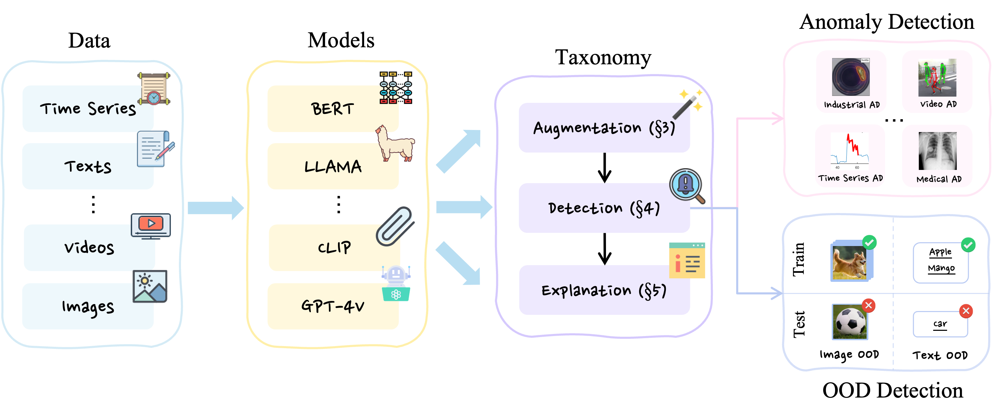
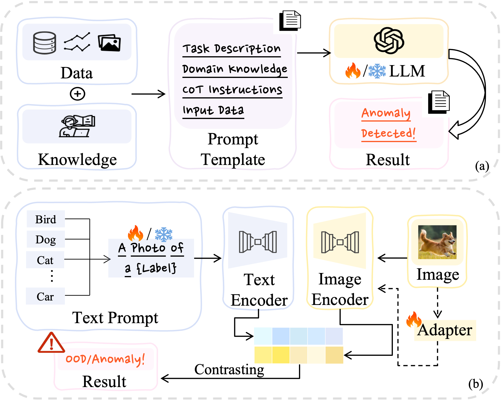

# Awesome LLMs for Anomaly and OOD Detection

Tracking advancements in "Large Language Models for Anomaly and Out-of-Distribution Detection", based on our detailed survey found at [Large Language Models for Anomaly and Out-of-Distribution Detection: A Survey]().

## Table of Contents

- [Introduction](#introduction)
- [Taxonomy](#taxonomy)
  - [LLMs for Augmentation](#llms-for-augmentation)
  - [LLMs for Detection](#llms-for-detection)
  - [LLMs for Explanation](#llms-for-explanation)
- [Citation](#citation)

## Introduction

Detecting anomalies or out-of-distribution (OOD) samples is critical for maintaining the reliability and trustworthiness of machine learning systems. Recently, Large Language Models (LLMs) have demonstrated their effectiveness not only in natural language processing but also in broader applications due to their advanced comprehension and generative capabilities. The integration of LLMs into anomaly and OOD detection marks a significant shift from the traditional paradigm in the field. This survey focuses on the problem of anomaly and OOD detection under the context of LLMs. We propose a new taxonomy to categorize existing approaches into three classes based on the role played by LLMs. Following our proposed taxonomy, we further discuss the related work under each of the categories and finally discuss potential challenges and directions for future research in this field. 
## Taxonomy

### LLMs for Augmentation

Exploring how LLMs support the augmentation of detection capabilities without being direct detectors.

| Paper | Authors | Backbone Model | Task Category | Dataset Type | Venue | Code |
|-------|---------|----------------|---------------|--------------|-------|------|
| [Envisioning outlier exposure by large language models for out-of-distribution detection](https://arxiv.org/abs/2406.00806) | Chentao Cao, Zhun Zhong, Zhanke Zhou, Yang Liu, Tongliang Liu, Bo Han | GPT-3.5-turbo-16k; CLIP | OOD Detection | Images | ICML, 2024 | [Code](https://github.com/tmlr-group/EOE) |
| [Out-of-Distribution Detection Using Peer-Class Generated by Large Language Model](https://arxiv.org/abs/2403.13324) | K Huang, G Song, Hanwen Su, Jiyan Wang | GPT-3; CLIP | OOD Detection | Images | ArXiv, 2024 | N/A |
| [On the Powerfulness of Textual Outlier Exposure for Visual OoD Detection](https://openreview.net/forum?id=090ORrOAPL) | Sangha Park, Jisoo Mok, Dahuin Jung, Saehyung Lee, Sungroh Yoon | BERT; BLIP-2; GPT-3; CLIP | OOD Detection | Images | NeurIPS, 2023 | [Code](https://github.com/wiarae/TOE) |
| [Contrastive Novelty-Augmented Learning: Anticipating Outliers with Large Language Models](https://aclanthology.org/2023.acl-long.658.pdf) | Albert Xu, Xiang Ren, Robin Jia | GPT-3; GPT-J; BERT | OOD Detection | Texts | ACL, 2023 | [Code](https://github.com/albertkx/CoNAL) |
| [Tagfog: Textual anchor guidance and fake outlier generation for visual out-of-distribution detection](https://ojs.aaai.org/index.php/AAAI/article/view/27871) | Jiankang Chen, Tong Zhang, Weishi Zheng, Ruixuan Wang | ChatGPT; CLIP | OOD Detection | Images | AAAI, 2024 | [Code](https://github.com/tagfog-ood) |
| [Do LLMs Understand Visual Anomalies? Uncovering LLM Capabilities in Zero-shot Anomaly Detection](https://arxiv.org/pdf/2404.09654) | Jiaqi Zhu, Shaofeng Cai, Fang Deng, Junran Wu | GPT-3.5; CLIP | Anomaly Detection | Images | ArXiv, 2024 | N/A |
| [Exploring large language models for multi-modal out-of-distribution detection](https://arxiv.org/abs/2310.08027) | Yi Dai, Hao Lang, Kaisheng Zeng, Fei Huang, Yongbin Li | text-davinci-003; CLIP | OOD Detection | Images | EMNLP, 2023 | N/A |
| [LogGPT: Exploring ChatGPT for log-based anomaly detection](https://arxiv.org/pdf/2309.01189) | Jiaxing Qi et al. | ChatGPT | Anomaly Detection | Log Data | IEEE HPCC, 2023 | [Code](https://github.com/LogIntelligence/LogADEmpirical) |
| [LogFiT: Log Anomaly Detection Using Fine-Tuned Language Models](https://ieeexplore.ieee.org/document/10414427) | Crispin Almodovar et al. | Various LLMs | Anomaly Detection | Log Data | IEEE TNSM 2024 | N/A |
| [How good are LLMs at out-of-distribution detection?](https://aclanthology.org/2024.lrec-main.720.pdf) | Andi Zhang et al. | LLaMA etc. | OOD Detection | Various | COLING, 2024 | [Code](https://github.com/Awenbocc/LLM-OOD) |
| [Your Finetuned Large Language Model is Already a Powerful Out-of-distribution Detector](https://arxiv.org/abs/2404.08679) | Andi Zhang, Tim Z Xiao, Weiyang Liu, Robert Bamler, Damon Wischik | Various LLMs | OOD Detection | Texts | arXiv, 2024 | N/A |

---

### LLMs for Detection

Highlighting how LLMs directly contribute to detecting anomalies and out-of-distribution samples.

| Paper | Authors | Backbone Model | Task Category | Dataset Type | Venue | Code |
|-------|---------|----------------|---------------|--------------|-------|------|
| [WinCLIP: Zero-/few-shot anomaly classification and segmentation](https://arxiv.org/pdf/2303.14814) | Jongheon Jeong, Yang Zou, Taewan Kim, Dongqing Zhang, Avinash Ravichandran, Onkar Dabeer | CLIP | Anomaly Detection | Images | CVPR, 2023 | [Code](https://github.com/caoyunkang/WinClip) |
| [CLIP-AD: A language-guided staged dual-path model for zero-shot anomaly detection](https://arxiv.org/abs/2311.00453) | Xuhai Chen, Jiangning Zhang, Guanzhong Tian, Haoyang He, Wuhao Zhang, Yabiao Wang, Chengjie Wang, Yunsheng Wu, Yong Liu | CLIP | Anomaly Detection | Images | arXiv, 2023 | N/A |
| [Exploring grounding potential of VQA-oriented GPT-4V for zero-shot anomaly detection](https://arxiv.org/abs/2311.02612) | Jiangning Zhang, Xuhai Chen, Zhucun Xue, Yabiao Wang, Chengjie Wang, Yong Liu | GPT-4V | Anomaly Detection | Images | arXiv, 2023 | [Code](https://github.com/zhangzjn/GPT-4V-AD) |
| [CLIPScope: Enhancing Zero-Shot OOD Detection with Bayesian Scoring](https://arxiv.org/pdf/2405.14737) | Hao Fu, Naman Patel, Prashanth Krishnamurthy, Farshad Khorrami | CLIP | OOD Detection | Images | ArXiv, 2024 | N/A |
| [AnomalyCLIP: Object-agnostic prompt learning for zero-shot anomaly detection](https://openreview.net/forum?id=buC4E91xZE) | Qihang Zhou, Guansong Pang, Yu Tian, Shibo He, Jiming Chen | CLIP | Anomaly Detection | Images | ICLR, 2024 | [Code](https://github.com/zqhang/anomalyclip) |
| [Toward generalist anomaly detection via in-context residual learning with few-shot sample prompts](https://arxiv.org/abs/2403.06495) | Jiawen Zhu, Guansong Pang | CLIP | Anomaly Detection | Images | CVPR, 2024 | [Code](https://github.com/mala-lab/inctrl) |
| [PromptAD: Learning prompts with only normal samples for few-shot anomaly detection](https://arxiv.org/abs/2404.05231) | Xiaofan Li, Zhizhong Zhang, Xin Tan, Chengwei Chen, Yanyun Qu, Yuan Xie, Lizhuang Ma | CLIP | Anomaly Detection | Images | CVPR, 2024 | [Code](https://github.com/FuNz-0/PromptAD) |
| [Text prompt with normality guidance for weakly supervised video anomaly detection](https://arxiv.org/abs/2404.08531) | Zhiwei Yang, Jing Liu, Peng Wu | CLIP | Anomaly Detection | Videos | arXiv, 2024 | N/A |
| [LoCoOp: Few-Shot Out-of-Distribution Detection via Prompt Learning](https://arxiv.org/pdf/2306.01293) | Miyai et al. | CLIP | OOD Detection | Images | NeurIPS, 2023 | [Code](https://github.com/atsumiyai/locoop) |
| [CLIPN for Zero-Shot OOD Detection: Teaching CLIP to Say No](https://arxiv.org/pdf/2308.12213) | Wang et al. | CLIP | OOD Detection | Images | ICCV, 2023 | [Code](https://github.com/xmed-lab/clipn) |
| [Out-Of-Distribution Detection With Negative Prompts](https://openreview.net/pdf?id=nanyAujl6e) | Nie et al. | CLIP | OOD Detection | Images | ICLR, 2024 | [Code](https://github.com/mala-lab/negprompt) |
| [ID-like Prompt Learning for Few-Shot Out-of-Distribution Detection](https://arxiv.org/pdf/2311.15243) | Yichen Bai, Zongbo Han, Changqing Zhang, Bing Cao, Xiaoheng Jiang, Qinghua Hu | CLIP | OOD Detection | Images | CVPR, 2024 | [Code](https://github.com/ycfate/id-like) |
| [Learning transferable negative prompts for out-of-distribution detection](https://arxiv.org/abs/2404.03248) | Tianqi Li, Guansong Pang, Xiao Bai, Wenjun Miao, Jin Zheng | CLIP | OOD Detection | Images | CVPR, 2024 | [Code](https://github.com/transferable-negative-prompts) |
| [AnomalyGPT: Detecting Industrial Anomalies Using Large Vision-Language Models](https://arxiv.org/pdf/2308.15366) | Zhaopeng Gu, Bingke Zhu, Guibo Zhu, Yingying Chen, Ming Tang, Jinqiao Wang | ImageBind-Huge; Vicuna-7B | Anomaly Detection | Images | ArXiv, 2024 | [Code](https://anomalygpt.github.io/) |
| [Adapting visual-language models for generalizable anomaly detection in medical images](https://arxiv.org/abs/2403.12570v1) | Chaoqin Huang, Aofan Jiang, Jinghao Feng, Ya Zhang, Xinchao Wang, Yanfeng Wang | CLIP | Anomaly Detection | Images | CVPR, 2024 | [Code](https://github.com/mediabrain-sjtu/mvfa-ad) |
| [Adapting Contrastive Language-Image Pretrained (CLIP) Models for Out-of-Distribution Detection](https://openreview.net/pdf?id=YCgX7sJRF1) | Nikolas Adaloglou, Felix Michels, Tim Kaiser, Markus Kollmann | CLIP | OOD Detection | Images | TMLR, 2024 | [Code](https://github.com/HHU-MMBS/plp-official-tmlr2024) |
| [Video anomaly detection and explanation via large language models](https://arxiv.org/abs/2401.05702) | Hui Lv, Qianru Sun | Video-LLaMA | Anomaly Detection | Videos | arXiv, 2024 | N/A |
| [VadCLIP: Adapting Vision-Language Models for Weakly Supervised Video Anomaly Detection](https://arxiv.org/abs/2401.05702) | Peng Wu, Xuerong Zhou, Guansong Pang, Lingru Zhou, Qingsen Yan, Peng Wang, Yanning Zhang | CLIP | Anomaly Detection | Videos | AAAI, 2023 | [Code](https://github.com/nwpu-zxr/vadclip) |
| [Delving into Out-of-Distribution Detection with Vision-Language Representations](https://arxiv.org/pdf/2211.13445.pdf) | Ming et al. | CLIP | OOD Detection | Images | NeurIPS, 2022 | [Code](https://github.com/deeplearning-wisc/mcm) |
| [Text prompt with normality guidance for weakly supervised video anomaly detection](https://arxiv.org/abs/2404.08531) | Zhiwei Yang, Jing Liu, Peng Wu | CLIP | Anomaly Detection | Videos | arXiv, 2024 | N/A |
| [Negative Label Guided OOD Detection with Pretrained Vision-Language Models](https://arxiv.org/pdf/2403.20078) | Xue Jiang, Feng Liu, Zhen Fang, Hong Chen, Tongliang Liu, Feng Zheng, Bo Han | CLIP; ALIGN; GroupViT; AltCLIP | OOD Detection | Images | ICLR, 2024 | [Code](https://github.com/XueJiang16/NegLabel) |
| [Zero-shot out-of-distribution detection based on the pretrained model CLIP](https://arxiv.org/pdf/2109.02748) | Sepideh Esmaeilpour, Bing Liu, Eric Robertson, Lei Shu | CLIP | OOD Detection | Images | AAAI, 2022 | [Code](https://arxiv.org/pdf/2109.02748) |
| [Large language models can be zero-shot anomaly detectors for time series?](https://arxiv.org/abs/2405.14755) | Sarah Alnegheimish, Linh Nguyen, Laure Berti-Equille, Kalyan Veeramachaneni | Mistral-7B-Instruct-v0.2; gpt-3.5-turbo-instruct | Anomaly Detection | Time Series | arXiv, 2024 | N/A |
| [Semantic anomaly detection with large language models](https://arxiv.org/abs/2305.11307) | Amine Elhafsi, Rohan Sinha, Christopher Agia, Edward Schmerling, Issa Nesnas, Marco Pavone | text-davinci-003 | Anomaly Detection | Videos | arXiv, 2023 | N/A |
| [Harnessing large language models for training-free video anomaly detection](https://arxiv.org/abs/2404.01014) | Luca Zanella, Willi Menapace, Massimiliano Mancini, Yiming Wang, Elisa Ricci | Llama-2-13b-chat; ImageBind | Anomaly Detection | Videos | CVPR, 2024 | [Code](https://github.com/lucazanella/lavad) |
| [Large language models can deliver accurate and interpretable time series anomaly detection](https://arxiv.org/abs/2405.15370) | Jiaqi Tang, Hao Lu, Ruizheng Wu, Xiaogang Xu, Ke Ma, Cheng Fang, Bin Guo, Jiangbo Lu, Qifeng Chen, Ying-Cong Chen | GPT-4-1106-preview | Anomaly Detection | Time Series | arXiv, 2024 | N/A |
| [FiLo: Zero-shot anomaly detection by fine-grained description and high-quality localization](https://arxiv.org/abs/2404.08531) | Zhaopeng Gu, Bingke Zhu, Guibo Zhu, Yingying Chen, Hao Li, Ming Tang, Jinqiao Wang | CLIP | Anomaly Detection | Vision | arXiv, 2024 | [Code](https://github.com/filo-anomaly-detection) |

---

### LLMs for Explanation

Detailing how LLMs aid in explaining the detection results, enhancing understanding and trust.

| Paper | Authors | Backbone Model | Task Category | Dataset Type | Venue | Code |
|-------|---------|----------------|---------------|--------------|-------|------|
| [Holmes-VAD: Towards Unbiased and Explainable Video Anomaly Detection via Multi-modal LLM](https://arxiv.org/pdf/2406.12235) | Huaxin Zhang, Xiaohao Xu, Xiang Wang, Jialong Zuo, Chuchu Han, Xiaonan Huang, Changxin Gao, Yuehuan Wang, Nong Sang | Video-LLaVA | Anomaly Detection | Videos | ArXiv, 2024 | [Code](https://github.com/pipixin321/holmesvad) |
| [Follow the Rules: Reasoning for Video Anomaly Detection with Large Language Models](https://arxiv.org/html/2407.10299v1) | Yuchen Yang, Kwonjoon Lee, Behzad Dariush, Yinzhi Cao, Shao-Yuan Lo | CogVLM-17B; GPT-4; Mistral-7B-Instruct-v0.2 | Anomaly Detection | Videos | ArXiv, 2024 | [Code](https://github.com/Yuchen413/AnomalyRuler) |
| [Video Anomaly Detection and Explanation via Large Language Models](https://arxiv.org/html/2401.05702v1) | Lv et al. | LLaMA | Anomaly Detection | Videos | ICCV, 2024 | N/A |
| [Real-Time Anomaly Detection and Reactive Planning with Large Language Models](https://arxiv.org/abs/2406.09876) | Sinha et al. | BERT, Llama 2 etc. | Anomaly Detection | Robotic Data | ArXiv, 2024 | N/A |

## Citation

If you find this work useful, please cite our survey paper:

         
